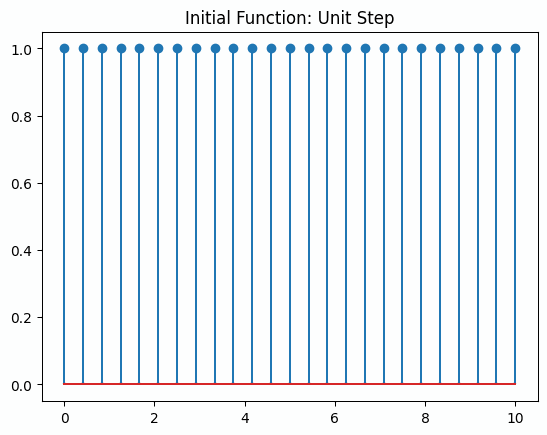

In my ECE 342 class, nearing the final two lectures, Professor Xingyu Li mentioned something curious.

$$\text{Let } u[n] = \text{unit step function}$$

She mentioned that, given the unit step function $u[n]$, let us propose that convoluting $u[n]$ by itself results in some function $u[n]_1$, describing a triangle mirrored about the y axis.

Further, convoluting this new function $u[n]_1$ by itself results in $u[n]_2$ results in a particular curve.

By performing this convolution repeatedly, we proceed towards the Gaussian distribution.

In fact, the fact that we're using the unit step function isn't special at all!

You can generalize this argument towards any given set of points.
I couldn't believe it, so I went coded this program to output three examples of "self-convolution".

1) The convolution of the unit step function 
2) The convolution of a random set of points
3) The convolution of some absolute sinusoidal function

Given three convolutions, we approach what seems to be the gaussian distribution. However, after four or so convolutions in python, we reach the limits of the machine and overflow.

After the lecture, upon questioning, I asked her why this is the case.
There exists two theorems that we can use to prove this behavior.

1) The Central Limit Theorem
2) The Law of Large Numbers

As the course is "Probability of Electrical and Computer Engineers", we do not cover the dense theorems/laws and focus much more on the application of Probability. However, I found this interesting and dug for further research.

That concludes this entry!

